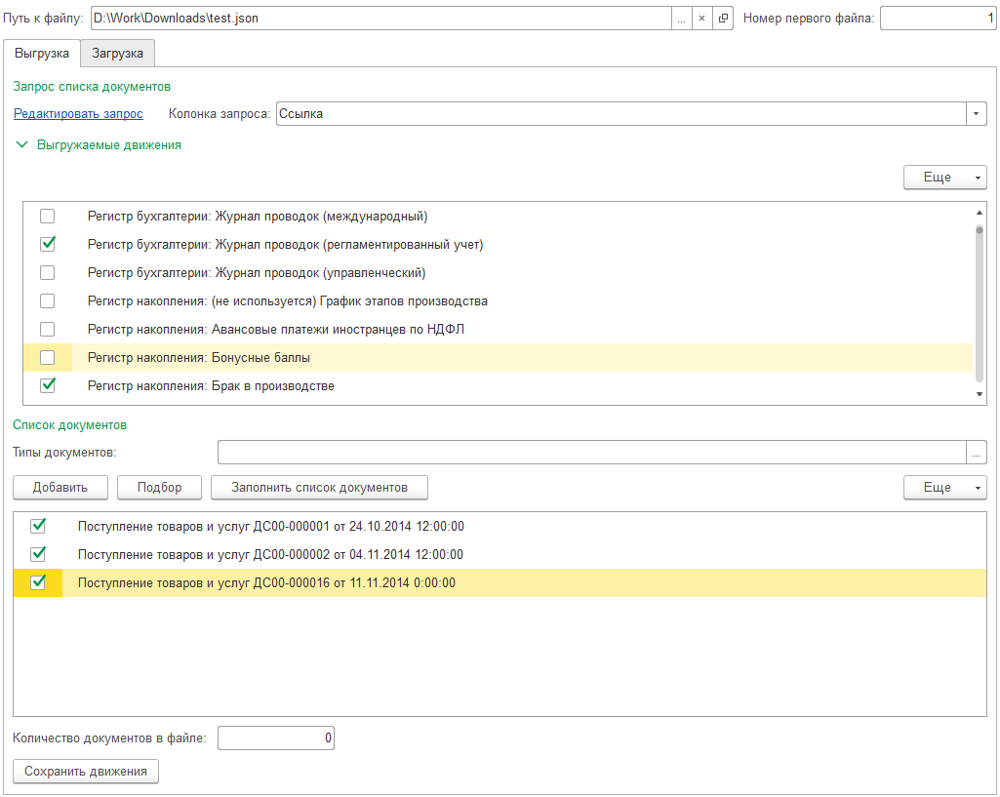
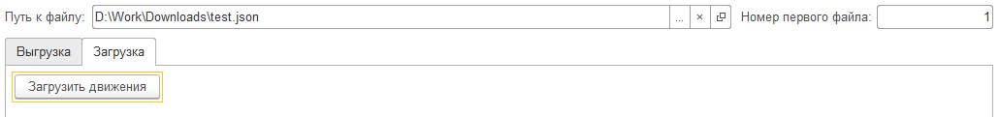

# RegDataMover
Перенос движений документов 1С между копиями баз

Обработка предназначена для переноса движений документов между информационныеми базами 1С. обработка позволяет:
1. Выбрать интересующие документы
    - в ручном режиме
    - с использованием запроса
2. Выбрать интересующие регистры для сохранения движений
3. Сохранить движения выбранных документов в файл в формате JSON
4. Загрузить движения документов в целевой информационной базе не выполняя операции проведения.
   
Файл запуска обработки: [ктв_ПереносДвиженийДокументов.epf](dp/bin/ктв_ПереносДвиженийДокументов.epf)

### Редактор запроса

### Сохранение движений

### Восстановление движений

